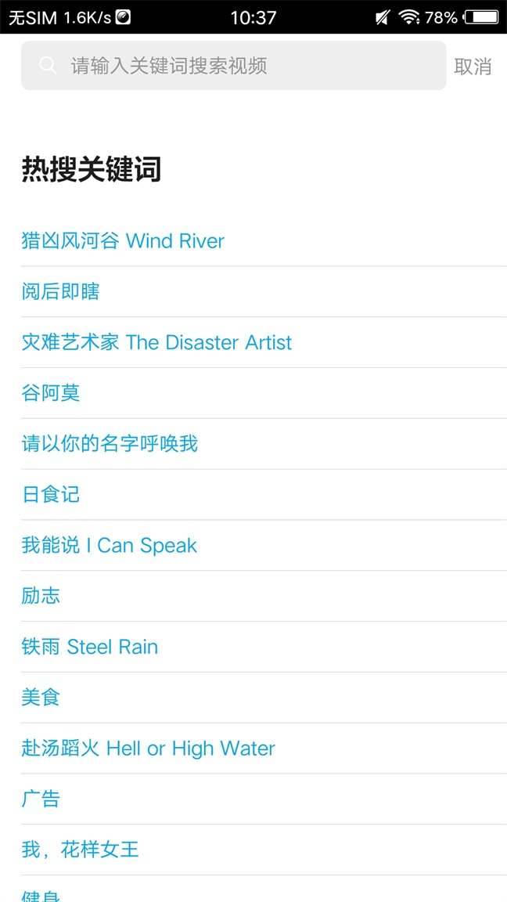
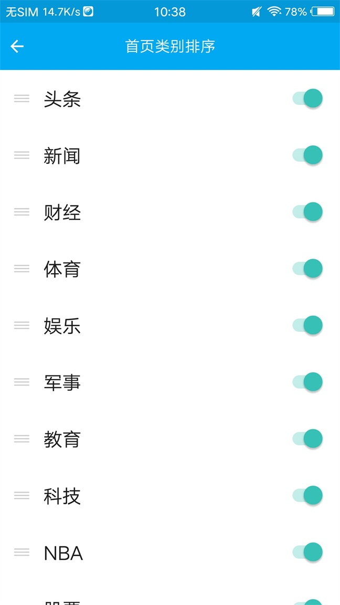
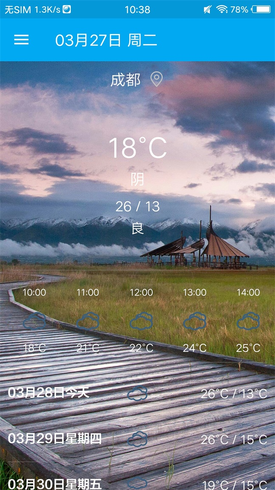
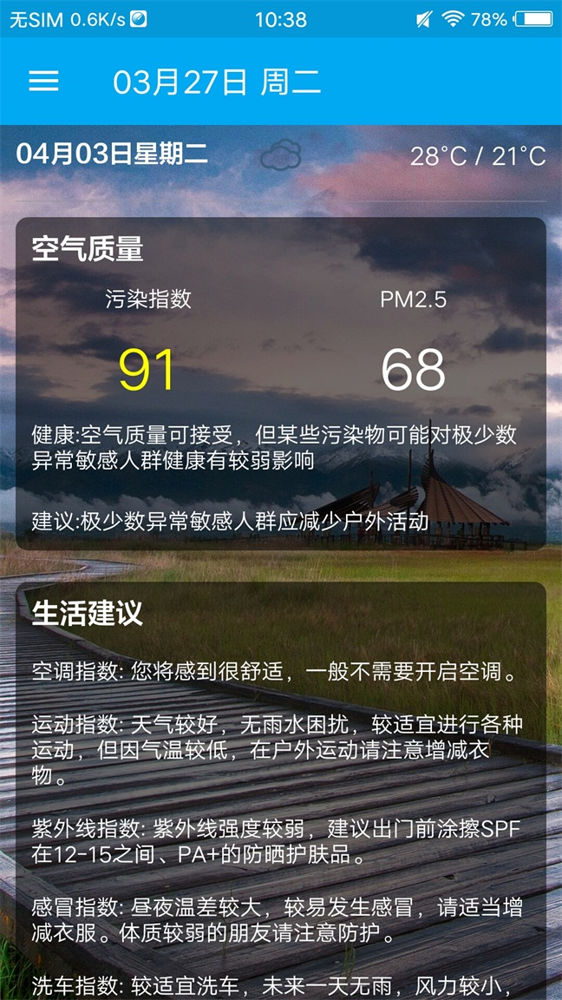

# LifeHelper

### 1. 我的毕业设计,目前含有的主要功能如下:

- 用户模块
- 知乎日报
- 小视频
- 新闻
- 天气
- 笑话
- 干货集中营

下载试玩

### 2. 用到的知识点:

- MVP
- SVG矢量图
- Material Design
- OkHttp3
- GSON
- Glide
- 组件化,路由
- Kotlin
- 热更新
- Retrofit2
- RxKotlin,RxAndroid
- ....

### 3.后台

我自己写的后台+Bmob,我的后台是Spring Boot写的,因为这玩意儿学起来和用起来都非常快.后台基本功能:

- 签到
- 注册
- 登录
- 点赞
- 评论
- 收藏

我的后台是部署到腾讯云上面的,还是比较稳的(后台代码可能不是很稳,新手....)

[后台代码在这里](https://github.com/xfhy/LifeHelperServer)

### 4. 截图

</img>
</img>
</img>
</img>
</img>
</img>
</img>
</img>
</img>
</img>
</img>
</img>
</img>
</img>
</img>
</img>
</img>

### 5. 总结

由于时间紧急,很多功能没有做的很完善....遇到有bug的话,麻烦提一下issue.
